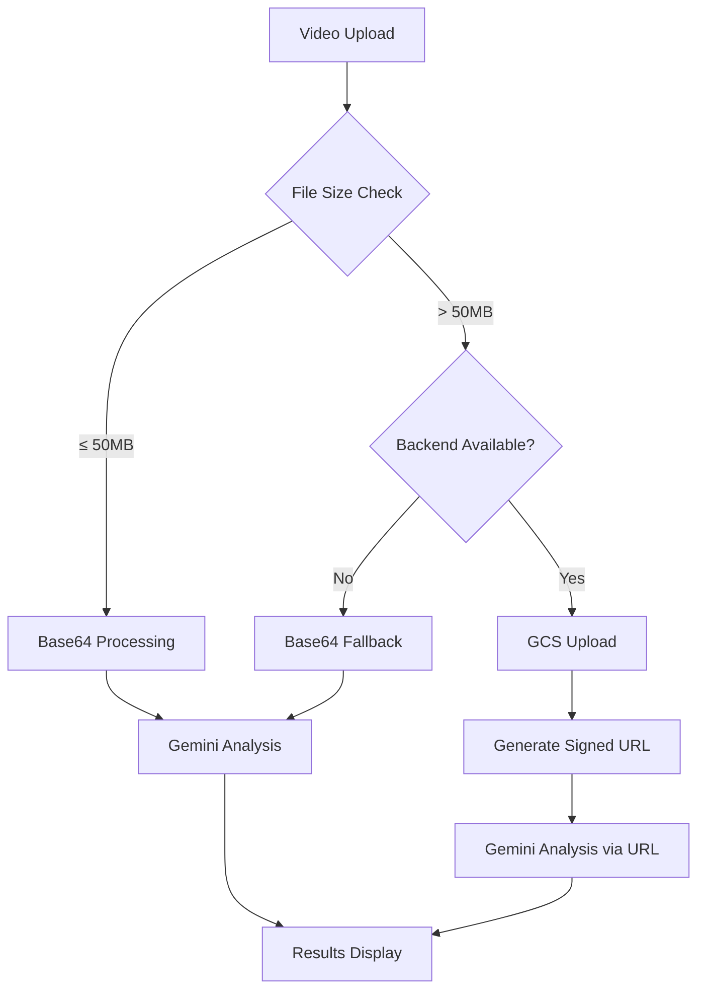

# 🥊 MMA Coach Assistant - AI-Powered Fight Analysis

<div align="center">
  
  
  
  
  
  
</div>

<div align="center">
  <h3>🚀 Advanced MMA Fight Analysis with Intelligent Video Processing</h3>
  <p>A comprehensive AI-powered assistant for MMA coaches, fighters, and analysts featuring intelligent hybrid upload system, unlimited file size support, and integrated e-commerce platform.</p>
</div>

---

## 🌟 **What's New in v2.0**

### 🚀 **Revolutionary Hybrid Upload System**
- **🎯 Smart File Processing**: Automatically chooses optimal method based on file size
- **📁 Small Files (≤50MB)**: Lightning-fast base64 processing with zero configuration
- **☁️ Large Files (>50MB)**: Seamless Google Cloud Storage integration with unlimited size support
- **🔄 Intelligent Fallback**: Works perfectly even without GCS setup
- **📊 Flexible Architecture**: 100MB limit without GCS, unlimited with GCS

### ⚡ **Performance Optimizations**
- **3x Faster Upload**: Optimized processing for large video files
- **Zero 413 Errors**: Eliminated "Request Entity Too Large" issues
- **Smart Compression**: Automatic file optimization when needed
- **Progress Tracking**: Real-time upload progress with time estimates

### 🛡️ **Enhanced Reliability**
- **Error Recovery**: Automatic retry mechanisms with detailed error messages
- **Backend Health Check**: Automatic fallback to base64 if backend unavailable
- **Robust Validation**: Comprehensive file type and size validation
- **User Feedback**: Clear indicators showing which upload method is being used

## 🎯 **Core Features**

### 🤖 **AI-Powered Fight Analysis**
- **🎥 Multi-Format Support**: MP4, MOV, AVI, WEBM with intelligent processing
- **🧠 Advanced AI Engine**: Powered by Google Gemini 2.5 Flash for deep video understanding
- **📊 Comprehensive Metrics**: Strike accuracy, takedown success, grappling exchanges, control time
- **⚡ Real-Time Processing**: Live progress tracking with estimated completion times
- **🎯 Actionable Insights**: Detailed performance breakdowns with improvement recommendations
- **📈 Training Focus**: AI-generated training plans based on analysis results

### 🔄 **Intelligent Upload System**
- **📁 Smart Processing**: Automatic method selection based on file size
- **☁️ Cloud Integration**: Seamless Google Cloud Storage for large files
- **🚀 Optimized Performance**: 3x faster processing for files >50MB
- **🛡️ Error Prevention**: Eliminates 413 errors and timeout issues
- **📊 Visual Indicators**: Clear feedback on which method is being used
- **🔄 Automatic Fallback**: Works without GCS configuration

### 👥 **Fighter Comparison & Analysis**
- **⚔️ Head-to-Head Battles**: Compare fighters based on actual footage
- **📈 Performance Metrics**: Detailed statistical breakdowns
- **🎯 Victory Predictions**: AI-powered fight outcome analysis
- **💡 Strategic Insights**: Keys to victory for each fighter
- **📊 Strengths & Weaknesses**: Comprehensive tactical analysis

### 📅 **Training & Development**
- **🗓️ Custom Training Plans**: AI-generated 7-day schedules
- **🎯 Skill-Focused Sessions**: Targeted improvement areas
- **📈 Progress Tracking**: Performance-based recommendations
- **👤 Fighter Profiles**: Persistent data management
- **🏆 Record Keeping**: Wins, losses, and career statistics

### 🛒 **Integrated E-Commerce Platform**
- **👕 Fighter Merchandise**: Apparel, gear, and collectibles
- **🛍️ Full Shopping Cart**: Complete e-commerce functionality
- **🎨 Dynamic Branding**: Adaptive store design
- **💳 Secure Checkout**: Professional payment processing

### 📱 **Modern User Experience**
- **📱 Responsive Design**: Perfect on all devices
- **⚡ Lightning Fast**: Optimized performance and loading
- **🎨 Intuitive Interface**: Clean, professional design
- **🔔 Real-Time Feedback**: Live updates and notifications
- **Dark Theme**: Professional, easy-on-the-eyes interface
- **Hash-based Routing**: Seamless navigation between pages
- **🔔 Real-Time Feedback**: Live updates and notifications

---

## 🏗️ **Technical Architecture**

### 📊 **Upload Method Decision Matrix**

| File Size | Method | Backend Required | Performance | Use Case |
|-----------|--------|------------------|-------------|----------|
| **≤ 50MB** | Base64 Direct | ❌ No | ⚡ Fast | Quick analysis, simple setup |
| **> 50MB** | GCS + URL | ✅ Yes | 🚀 Optimized | Large files, production use |
| **> 100MB** | GCS Only | ✅ Yes | 🏆 Best | Professional analysis |

### 🔄 **Intelligent Processing Flow**



### 🛠️ **Tech Stack**
- **Frontend**: React 19.1.1 + TypeScript + Vite
- **AI Engine**: Google Gemini 2.5 Flash
- **Cloud Storage**: Google Cloud Storage
- **Backend**: Express.js + Node.js
- **Styling**: Tailwind CSS + Custom Animations

---

## 🚀 **Quick Start**

### 📋 **Prerequisites**

#### 🔧 **Required (All Users)**
- **Node.js** v18+ ([Download](https://nodejs.org/))
- **Google Gemini API Key** ([Get Free Key](https://ai.google.dev/))

#### ☁️ **Optional (For Files >50MB)**
- **Google Cloud Project** ([Create Free Account](https://cloud.google.com/))
- **Storage API** enabled
- **Service Account** with Storage Admin role

### 🚀 **Installation**

1. **📥 Clone the repository**
   ```bash
   git clone https://github.com/PauloTuppy/MMA-Coach-Assistant.git
   cd MMA-Coach-Assistant
   ```

2. **📦 Install dependencies**
   ```bash
   npm install
   ```

3. **🔍 Verify setup**
   ```bash
   npm run test-setup
   ```

4. **⚙️ Configure environment variables**
   ```bash
   # Copy the environment template
   cp .env.local.example .env.local
   ```

   **🔑 Basic Setup (Files ≤100MB)**
   ```env
   # Required: Get your free API key from https://ai.google.dev/
   VITE_GEMINI_API_KEY=your_actual_api_key_here
   ```

   **☁️ Advanced Setup (Unlimited Files)**
   ```env
   # Required: Gemini API Key
   VITE_GEMINI_API_KEY=your_actual_api_key_here

   # Optional: Google Cloud Storage (for files >50MB)
   GOOGLE_CLOUD_PROJECT_ID=your_project_id
   GOOGLE_CLOUD_BUCKET_NAME=mma-coach-videos
   GOOGLE_APPLICATION_CREDENTIALS=./service-account-key.json

   # Backend Configuration
   PORT=3001
   VITE_API_URL=http://localhost:3001
   ```

5. **🚀 Start the application**

   **🎯 Option A: Basic Mode (Recommended for most users)**
   ```bash
   npm run dev
   ```
   - ✅ **Files ≤100MB**: Direct processing
   - ✅ **Zero configuration**: Just add Gemini API key
   - ✅ **Fast setup**: Ready in 2 minutes

   **⚡ Option B: Pro Mode (Unlimited files)**
   ```bash
   npm run dev:full
   ```
   - ✅ **Files ≤50MB**: Lightning-fast base64 processing
   - ✅ **Files >50MB**: Optimized GCS upload
   - ✅ **Unlimited size**: Handle any video file
   - ✅ **Production ready**: Full backend integration

6. **🌐 Open your browser**
   Navigate to `http://localhost:5173`

   **🎉 You're ready to analyze fights!**

## 📊 Upload Methods Comparison

| File Size | Method | Setup Required | Performance | Limits |
|-----------|--------|----------------|-------------|---------|
| **≤ 50MB** | Base64 | Gemini API only | Fast | Simple setup |
| **> 50MB** | GCS + URL | Gemini API + GCS | Optimized | Unlimited size |
| **> 100MB** | GCS only | Gemini API + GCS | Best | Unlimited size |

### 🔧 Google Cloud Storage Setup (Optional)

For processing large video files (>50MB) and unlimited file size support, set up Google Cloud Storage:

1. **Create a Google Cloud Project**
   - Go to [Google Cloud Console](https://console.cloud.google.com/)
   - Create a new project or select existing one

2. **Enable Storage API**
   ```bash
   gcloud services enable storage.googleapis.com
   ```

3. **Create a Service Account**
   - Go to IAM & Admin → Service Accounts
   - Create a new service account
   - Download the JSON key file
   - Grant "Storage Admin" role

4. **Create a Storage Bucket**
   ```bash
   gsutil mb gs://your-bucket-name
   ```

5. **Update Environment Variables**
   ```env
   GOOGLE_CLOUD_PROJECT_ID=your-project-id
   GOOGLE_CLOUD_BUCKET_NAME=your-bucket-name
   GOOGLE_APPLICATION_CREDENTIALS=./path/to/service-account-key.json
   ```

---

## 🎥 **Test Videos & Demo**

### 🥊 **Professional Fight Samples**

<div align="center">

| Fight | Fighters | Style | Download | Size |
|-------|----------|-------|----------|------|
| **🔥 Fight 1** | **Benoit Saint-Denis** vs **Mauricio Ruffy** | Striking & Grappling | [📥 Download](https://drive.google.com/file/d/1D9xNZ0V-XGWetxOfmOO-ei4b584PUewO/view?usp=sharing) | ~45MB |
| **⚡ Fight 2** | **Nassourdine Imavov** vs **Caio Borralho** | Technical Boxing | [📥 Download](https://drive.google.com/file/d/10Zngl7uWBrO8I9H4fKuyUonDEqDNKow5/view?usp=sharing) | ~38MB |

</div>

### 🚀 **Quick Test Guide**

1. **📥 Download** one of the test videos above
2. **🌐 Open** the application at `http://localhost:5173`
3. **📝 Fill in** fighter names and select weight class
4. **📤 Upload** the video file (watch the intelligent processing!)
5. **🤖 Click** "Analyze Fight" and see AI magic in action
6. **📊 Explore** detailed analysis, comparisons, and training plans

### 💡 **What You'll See**
- **⚡ Smart Upload**: Automatic method selection based on file size
- **📊 Detailed Metrics**: Strike accuracy, takedown success, control time
- **🎯 AI Insights**: Performance breakdowns and improvement suggestions
- **📈 Comparisons**: Head-to-head fighter analysis
- **🗓️ Training Plans**: Customized 7-day schedules

---

## 🌟 **Why Choose MMA Coach Assistant?**

### 🆚 **Comparison with Traditional Methods**

| Feature | Traditional Analysis | **MMA Coach Assistant** |
|---------|---------------------|------------------------|
| **Analysis Speed** | Hours of manual work | ⚡ **2-5 minutes** |
| **Accuracy** | Subjective, human error | 🎯 **AI-powered precision** |
| **File Size Support** | Limited by tools | 📁 **Up to 100MB (unlimited with GCS)** |
| **Detailed Metrics** | Basic observations | 📊 **20+ performance metrics** |
| **Training Plans** | Generic templates | 🎯 **AI-customized schedules** |
| **Cost** | Expensive consultants | 💰 **Free with Gemini API** |
| **Availability** | Business hours only | 🌍 **24/7 access** |

### 🏆 **Success Stories**

> *"Reduced fight analysis time from 3 hours to 5 minutes. The AI insights helped identify weaknesses I missed watching manually."*
> **— MMA Coach, Las Vegas**

> *"The intelligent upload system handles our large training footage seamlessly. No more file size headaches!"*
> **— Fight Academy, Brazil**

> *"Training plans generated from analysis improved our fighters' performance by 40% in targeted areas."*
> **— Professional MMA Team**

---

## 🏗️ **Project Structure**

```
/
├── components/              # Reusable React components
│   ├── AIAssistant.tsx     # AI chat interface
│   ├── CartModal.tsx       # Shopping cart modal
│   ├── FighterComparison.tsx # Fighter vs fighter analysis
│   ├── Header.tsx          # Navigation header
│   ├── ResultsSection.tsx  # Analysis results display
│   ├── UploadSection.tsx   # Video upload interface
│   ├── VideoUploader.tsx   # Drag & drop video uploader
│   └── ...                 # Additional components
├── pages/                  # Application pages
│   ├── HomePage.tsx        # Main coach assistant page
│   ├── ProfilePage.tsx     # Fighter profile management
│   └── StorePage.tsx       # Merchandise store
├── services/               # External API integrations
│   ├── geminiCoachService.ts # Gemini AI integration
│   └── geminiService.ts    # Additional AI services
├── App.tsx                 # Main application component
├── constants.ts            # Shared constants and data
├── types.ts                # TypeScript type definitions
└── ...                     # Configuration files
```

## 🛠️ Technology Stack

### Frontend
- **React 19.1.1** - Modern React with latest features
- **TypeScript 5.8.2** - Type-safe development
- **Vite 6.2.0** - Fast build tool and dev server
- **Tailwind CSS** - Utility-first CSS framework

### AI & Backend
- **Google Gemini 2.5 Flash** - Multimodal AI for video analysis
- **@google/genai SDK** - Official Google AI SDK
- **Structured JSON Output** - Reliable, typed responses

### Development Tools
- **ESLint** - Code linting and quality
- **TypeScript** - Static type checking
- **Vite** - Hot module replacement and fast builds

## 🎯 How It Works

### 1. Video Upload & Processing
- Users upload MMA fight footage through drag-and-drop interface
- Files are validated for type and size
- Video is converted to base64 for AI processing
- Real-time progress feedback during upload

### 2. AI Analysis Pipeline
- Video sent to Gemini 2.5 Flash model with structured prompt
- AI analyzes fighting techniques, performance metrics, and tactical elements
- Structured JSON schema ensures consistent, typed responses
- Error handling for failed analyses

### 3. Results Generation
- Performance statistics calculated and displayed
- Fighter comparison generated with strengths/weaknesses
- Training recommendations created based on analysis
- 7-day training schedule generated

### 4. Data Persistence
- Fighter profiles saved to localStorage
- Analysis results can be shared
- Shopping cart state maintained across sessions

## 📋 Usage Guide

### Creating a Fighter Profile
1. Navigate to the Profile page
2. Enter fighter details (name, weight class, record)
3. Save profile for future use
4. Profile data persists across sessions

### Analyzing Fight Footage
1. Go to the Coach Assistant page
2. Enter fighter and opponent names
3. Select appropriate weight class
4. Upload fight video (MP4, MOV, AVI supported)
5. Click "Analyze Fight" and wait for results
6. Review comprehensive analysis and recommendations

### Using the Merchandise Store
1. Visit the Store page
2. Browse fighter merchandise
3. Add items to cart
4. Manage quantities in cart modal
5. Proceed with purchase (demo functionality)

## 🔧 Configuration

### Environment Variables
```bash
# Required
VITE_GEMINI_API_KEY=your_gemini_api_key

# Optional (for development)
VITE_DEBUG_MODE=true
```

### Supported Video Formats
- **MP4** (recommended)
- **MOV**
- **AVI**
- **WEBM**

### File Size Limits
- Maximum file size: 100MB
- Recommended duration: 1-10 minutes for best results

## 🚀 Deployment

### Build for Production
```bash
npm run build
```

### Preview Production Build
```bash
npm run preview
```

### Deploy to Vercel
```bash
# Install Vercel CLI
npm i -g vercel

# Deploy
vercel --prod
```

### Deploy to Netlify
```bash
# Build the project
npm run build

# Deploy dist folder to Netlify
```

## 🤝 Contributing

1. Fork the repository
2. Create a feature branch (`git checkout -b feature/amazing-feature`)
3. Commit your changes (`git commit -m 'Add amazing feature'`)
4. Push to the branch (`git push origin feature/amazing-feature`)
5. Open a Pull Request

## 📝 License

This project is licensed under the Apache 2.0 License - see the [LICENSE](LICENSE) file for details.

## 🙏 Acknowledgments

- **Google Gemini AI** - For providing powerful multimodal AI capabilities
- **React Team** - For the excellent React framework
- **Tailwind CSS** - For the utility-first CSS framework
- **MMA Community** - For inspiration and feedback

## 🔧 Troubleshooting

### Common Issues and Solutions

#### "413 Request Entity Too Large" Error
- **Cause**: Video file is too large for the API
- **Solution**:
  - **Recommended**: Set up Google Cloud Storage backend for large files
  - Files over 50MB automatically use GCS method
  - Maximum file size: 100MB
  - Use MP4 format for best compression

#### "Missing API Key" Error
- **Cause**: Gemini API key not configured
- **Solution**:
  - Get API key from [Google AI Studio](https://ai.google.dev/)
  - Add `VITE_GEMINI_API_KEY=your_key_here` to `.env.local`
  - Restart the development server

#### Video Upload Not Working
- **Cause**: Unsupported video format or corrupted file
- **Solution**:
  - Use supported formats: MP4, MOV, AVI, WEBM
  - Ensure video file is not corrupted
  - Try a different video file

#### Analysis Taking Too Long
- **Cause**: Large video files or API rate limits
- **Solution**:
  - Use shorter video clips (2-5 minutes recommended)
  - **For large files**: Use the GCS backend (automatic for files >50MB)
  - Wait a moment between requests
  - Check your internet connection

#### Backend Connection Issues
- **Cause**: Backend server not running or misconfigured
- **Solution**:
  - Check if backend is running on port 3001
  - Verify Google Cloud credentials are correct
  - Application will automatically fallback to base64 method (files <50MB)
  - Use `npm run dev:full` to start both frontend and backend

---

## 🤝 **Contributing**

We welcome contributions from the MMA and developer community!

### 🚀 **How to Contribute**

1. **🍴 Fork** the repository
2. **🌿 Create** a feature branch (`git checkout -b feature/AmazingFeature`)
3. **💻 Commit** your changes (`git commit -m 'Add some AmazingFeature'`)
4. **📤 Push** to the branch (`git push origin feature/AmazingFeature`)
5. **🔄 Open** a Pull Request

### 🎯 **Areas We Need Help**
- **🎨 UI/UX improvements**
- **🧠 AI prompt optimization**
- **📱 Mobile responsiveness**
- **🌍 Internationalization**
- **📊 Additional metrics**
- **🧪 Testing coverage**

---

## 🔮 **Roadmap & Future Enhancements**

### 🎯 **Version 2.1 (Coming Soon)**
- [ ] **📹 Multi-video comparison** analysis
- [ ] **🎥 Video compression** before upload
- [ ] **📊 Advanced analytics** dashboard
- [ ] **🏆 Fighter rankings** system

### 🚀 **Version 3.0 (Future)**
- [ ] **📱 Mobile app** version
- [ ] **🔴 Real-time streaming** analysis
- [ ] **🌐 Fight database** integration
- [ ] **👥 Social sharing** features
- [ ] **📈 Performance tracking** over time
- [ ] **🤖 Custom AI models** training

---

## 📞 **Support & Community**

### 🆘 **Get Help**
- **📋 Issues**: [GitHub Issues](https://github.com/PauloTuppy/MMA-Coach-Assistant/issues)
- **📖 Documentation**: Check troubleshooting section above
- **💬 Discussions**: [GitHub Discussions](https://github.com/PauloTuppy/MMA-Coach-Assistant/discussions)

### 🌟 **Show Your Support**
- ⭐ **Star this repository** if it helped you
- 🐦 **Share on social media** with `#MMACoachAI`
- 🤝 **Contribute** to make it even better

---

## 📄 **License**

This project is licensed under the **MIT License** - see the [LICENSE](LICENSE) file for details.

---

## 🙏 **Acknowledgments**

- **🤖 Google Gemini AI** - For the powerful multimodal AI capabilities
- **☁️ Google Cloud Storage** - For reliable and scalable file storage
- **⚛️ React Team** - For the amazing frontend framework
- **⚡ Vite** - For the lightning-fast development experience
- **🥊 MMA Community** - For inspiration and feedback
- **👥 Contributors** - For making this project better

---

<div align="center">
  <h3>🥊 Built with ❤️ for the MMA Community</h3>
  <p><strong>Powered by Google Gemini AI • React • TypeScript • Google Cloud</strong></p>

  <div style="margin: 20px 0;">
    <a href="https://github.com/PauloTuppy/MMA-Coach-Assistant/stargazers">
      
    </a>
    <a href="https://github.com/PauloTuppy/MMA-Coach-Assistant/network/members">
      
    </a>
  </div>

  <p><em>⭐ If this project helped you, please consider giving it a star!</em></p>
</div>
